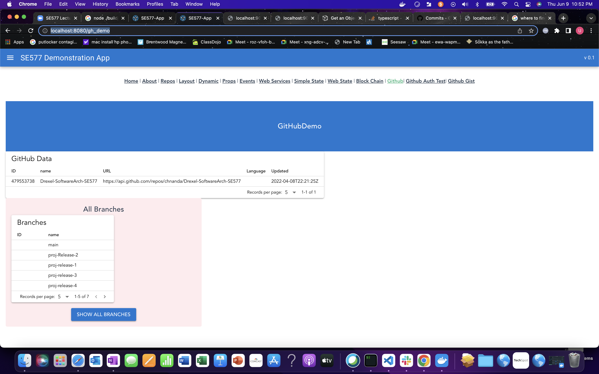

# FinaL Project

## My Final project is about rendering all my repos and display in a tabular format.

## Then explore the branches in each repo , it displays all branches that have been created and displayed in a table.

Created a Gitbub demo link @ http://localhost:8080/gh_demo

In this the components call the github API's to display the repo list
I have built one more component page which renders the branches in each repo.

## The steps to run and test the microservice in Docker

The Git hub personal token is provide in blackboard.

### use the make file to run,

My microservices are in webservices folder, can be deployed to Docker.

1)Fastify server

make build-server
make docker-server
make docker-run

Running on 9094

From the UI I made changes to the axiom calls to point to the doceker port to call the API
Ex: http://localhost:9094/gh/users/chnanda

Update UI pages to reflect the github api calls.

2. Deploy quasar app in docker to run the UI on port 8080

3. steps in the makefile.

Steps to run the application and architecture [Steps](finalRelease.md)
