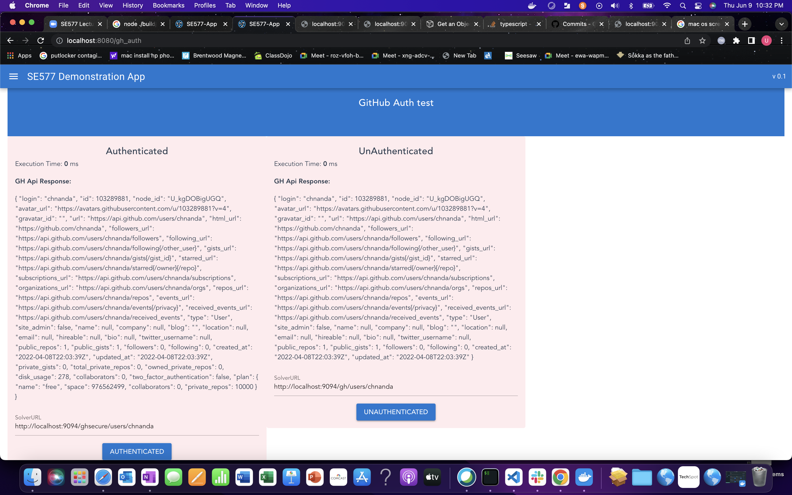

# Week 8 Deliverable - proj-release-4

## creating and rendering a Gist from the UI using GIT HUB API

Created a Gitbub Gist link @ http://localhost:8080/gh_gist

In this the components call the github API's to display the gists
I have built two pages one with token which gives only my gists
and the other with a big list of public gists.

## Developed a simple app to test the Github Auth token

As requested created two sections with Authentication and UnAthentication, provided buttons which calls the Github API and renders the details. One with plan object and other with out planobject.
http://localhost:8080/gh_auth

## The steps to run and test the microservice in Docker

### use the make file to run,

My microservices are in webservices folder, can be deployed to Docker.

1)Fastify server

make build-server
make docker-server
make docker-run

Running on 9094

From the UI I made changes to the axiom calls to point to the doceker port to call the API
Ex: http://localhost:9094/gh/users/chnanda

Update UI pages to reflect the github api calls.

2. Deploy quasar app in docker to run the UI on port 8080

3. steps in the makefile.

Steps to run the application and architecture [Steps](Release3.md)
